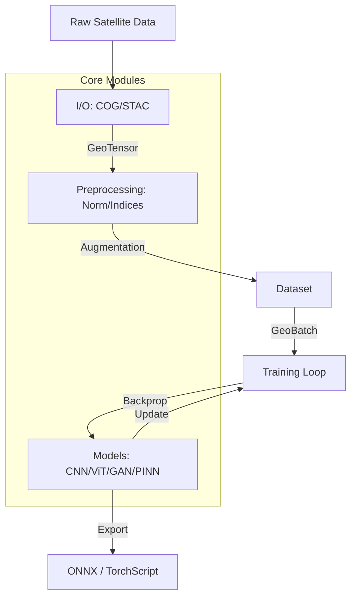

# Ununennium

**Production-grade Python library for satellite and geospatial imagery machine learning.**

## Features

- **Cloud-Native I/O**: COG, STAC, Zarr support
- **CRS-Aware**: Geographic coordinate tracking
- **Modern Architectures**: CNNs, ViTs, Foundation Models
- **GAN Support**: Image translation and super-resolution
- **Physics-Informed**: PDE-constrained learning
- **Reproducible**: Deterministic training

## Architecture



## Quick Start


```python
import ununennium as uu

# Load imagery
tensor = uu.io.read_geotiff("image.tif")

# Create model
model = uu.models.create("unet", in_channels=12, num_classes=10)

# Train
trainer = uu.training.Trainer(model=model, ...)
trainer.fit(epochs=100)
```

## Installation

```bash
pip install "ununennium[all]"
```

## Documentation

- [Getting Started](getting_started.md)
- [API Reference](api/core.md)
- [Tutorials](tutorials/segmentation.md)
